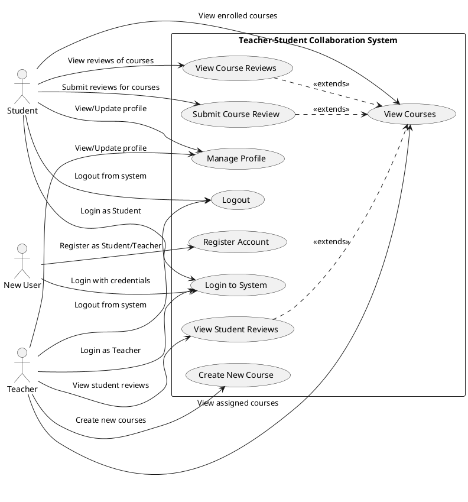
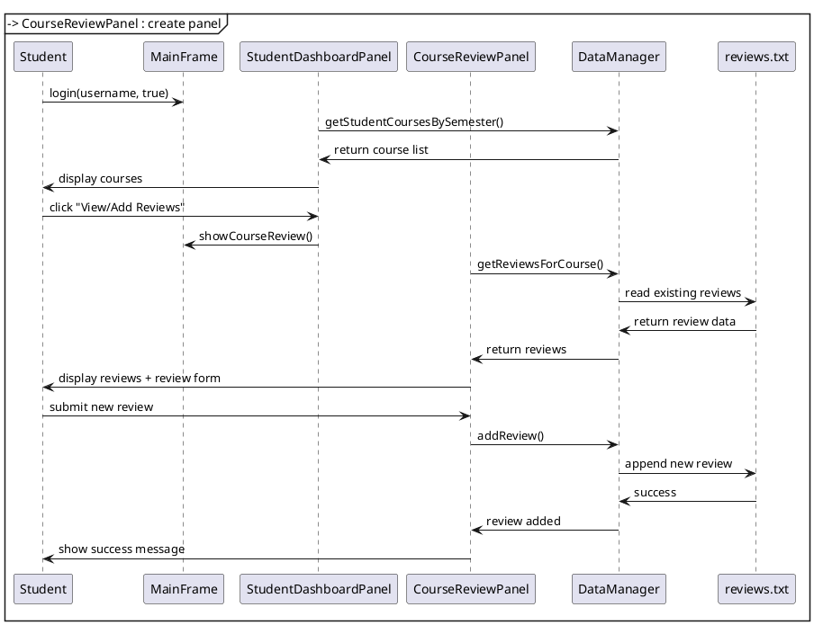
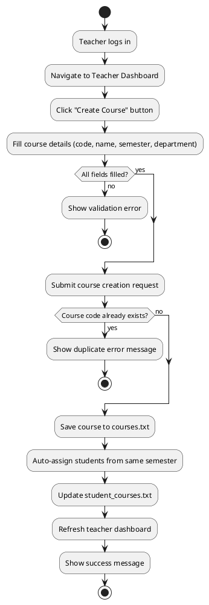

# Teacher-Student Collaboration System - UML Diagrams

## 1. Class Diagram (PlantUML Format)

```plantuml
@startuml Teacher-Student Collaboration System

' Core Entity Classes
class Course {
    - courseCode: String
    - courseName: String
    - teacherUsername: String
    - semester: String
    - department: String
    + Course(courseCode, courseName, teacherUsername, semester, department)
    + getCourseCode(): String
    + getCourseName(): String
    + getTeacherUsername(): String
    + getSemester(): String
    + getDepartment(): String
}

class Review {
    - timestamp: long
    - studentUsername: String
    - courseCode: String
    - teacherUsername: String
    - rating: int
    - comment: String
    + Review(timestamp, studentUsername, courseCode, teacherUsername, rating, comment)
    + getTimestamp(): long
    + getStudentUsername(): String
    + getCourseCode(): String
    + getTeacherUsername(): String
    + getRating(): int
    + getComment(): String
}

' Data Management Class
class DataManager {
    + {static} STUDENTS_FILE: String
    + {static} TEACHERS_FILE: String
    + {static} COURSES_FILE: String
    + {static} STUDENT_COURSES_FILE: String
    + {static} REVIEWS_FILE: String

    + {static} initializeData(): void
    + {static} validateLogin(username, password, isStudent): boolean
    + {static} getUserFullName(username, isStudent): String
    + {static} registerUser(username, password, fullName, extraInfo, isStudent): boolean
    + {static} usernameExists(username, isStudent): boolean
    + {static} createCourse(courseCode, courseName, teacherUsername, semester, department): boolean
    + {static} getAllCoursesWithDetails(): Map<String, Course>
    + {static} getTeacherCourses(teacherUsername): List<Course>
    + {static} getStudentCoursesBySemester(studentUsername, studentSemester): List<Course>
    + {static} addReview(studentUsername, courseCode, teacherUsername, rating, comment): boolean
    + {static} getReviewsForCourse(courseCode, teacherUsername): List<Review>
}

' Main Application Frame
class MainFrame {
    - cardLayout: CardLayout
    - mainPanel: JPanel
    - panels: Map<String, JPanel>
    - navigationStack: Stack<String>
    - currentUsername: String
    - isCurrentUserStudent: boolean

    + MainFrame()
    + showPanel(panelName): void
    + goBack(): void
    + login(username, isStudent): void
    + logout(): void
    + showRegistration(): void
    + showCourseReview(studentUsername, course, teacherName): void
    + showTeacherReview(teacherUsername, course): void
    + showCreateCourse(teacherUsername): void
    + refreshTeacherDashboard(): void
}

' UI Panel Classes
class LoginPanel {
    - usernameField: JTextField
    - passwordField: JPasswordField
    - studentRadio: JRadioButton
    - teacherRadio: JRadioButton
    - mainFrame: MainFrame

    + LoginPanel(mainFrame)
    - initComponents(): void
    - layoutComponents(): void
}

class RegistrationPanel {
    - usernameField: JTextField
    - passwordField: JPasswordField
    - confirmPasswordField: JPasswordField
    - fullNameField: JTextField
    - extraInfoField: JTextField
    - semesterCombo: JComboBox<String>
    - studentRadio: JRadioButton
    - teacherRadio: JRadioButton
    - isStudent: boolean
    - mainFrame: MainFrame

    + RegistrationPanel(mainFrame)
    - initComponents(): void
    - layoutComponents(): void
    - updateFormForUserType(): void
}

class StudentDashboardPanel {
    - studentUsername: String
    - studentFullName: String
    - mainFrame: MainFrame
    - coursesPanel: JPanel

    + StudentDashboardPanel(mainFrame, username)
    - initComponents(): void
    - loadCourses(): void
    - createCoursePanel(course, teacherName): JPanel
}

class TeacherDashboardPanel {
    - teacherUsername: String
    - teacherFullName: String
    - mainFrame: MainFrame
    - coursesPanel: JPanel

    + TeacherDashboardPanel(mainFrame, username)
    - initComponents(): void
    - loadCourses(): void
    - createCoursePanel(course): JPanel
    + refreshCourses(): void
}

class CreateCoursePanel {
    - teacherUsername: String
    - mainFrame: MainFrame
    - courseCodeField: JTextField
    - courseNameField: JTextField
    - semesterCombo: JComboBox<String>
    - departmentCombo: JComboBox<String>

    + CreateCoursePanel(mainFrame, teacherUsername)
    - initComponents(): void
    - layoutComponents(): void
}

class CourseReviewPanel {
    - studentUsername: String
    - course: Course
    - teacherName: String
    - mainFrame: MainFrame
    - reviewsPanel: JPanel
    - commentArea: JTextArea
    - ratingSlider: JSlider

    + CourseReviewPanel(mainFrame, studentUsername, course, teacherName)
    - initComponents(): void
    - loadReviews(): void
    - submitReview(): void
}

class TeacherReviewPanel {
    - teacherUsername: String
    - course: Course
    - mainFrame: MainFrame
    - reviewsPanel: JPanel

    + TeacherReviewPanel(mainFrame, teacherUsername, course)
    - initComponents(): void
    - loadReviews(): void
}

' Main Application Entry Point
class TeacherStudentCollaborationApp {
    + {static} main(args: String[]): void
}

' Relationships
MainFrame "1" *-- "many" LoginPanel
MainFrame "1" *-- "many" RegistrationPanel
MainFrame "1" *-- "many" StudentDashboardPanel
MainFrame "1" *-- "many" TeacherDashboardPanel
MainFrame "1" *-- "many" CreateCoursePanel
MainFrame "1" *-- "many" CourseReviewPanel
MainFrame "1" *-- "many" TeacherReviewPanel

DataManager ..> Course : creates
DataManager ..> Review : creates

StudentDashboardPanel ..> Course : uses
TeacherDashboardPanel ..> Course : uses
CourseReviewPanel ..> Course : uses
CourseReviewPanel ..> Review : creates
TeacherReviewPanel ..> Review : displays

TeacherStudentCollaborationApp --> MainFrame : creates

@enduml
```

## 2. Use Case Diagram (PlantUML Format)

## 3. Sequence Diagram - Student Course Review Process

## 4. Activity Diagram - Course Creation Process

@endmarkdown
